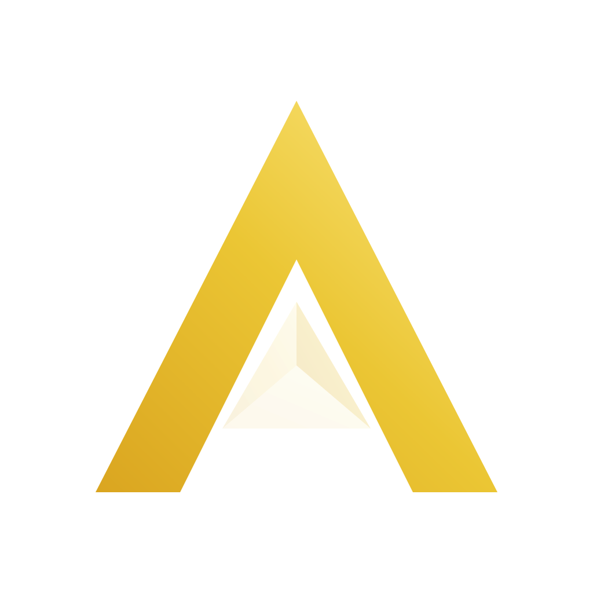

  <!-- Logo -->
  <picture>
    <source media="(prefers-color-scheme: dark)" srcset="./assets/aurym-logo-light.svg">
    <source media="(prefers-color-scheme: light)" srcset="./assets/aurym-logo-dark.svg">
    
  </picture>

  <h1 style="font-family: 'Optima', 'Palatino Sans', sans-serif; font-weight: normal; letter-spacing: 0.25em; margin-top: 4px;">
    Aurym
  </h1>
  

    昀昕成字，日光成金。
  

  <!-- 产品矩阵 -->
  <table align="center">
    <tr>
      <td align="center"><strong>🎵 Aurym Music</strong></td>
      <td align="center"><strong>🛠️ Aurym Tools</strong></td>
      <td align="center"><strong>📄 Aurym Docs</strong></td>
    </tr>
    <tr>
      <td align="center">BiliBili收藏夹 鸿蒙音乐播放器</td>
      <td align="center">开源跨平台 开发者工具箱</td>
      <td align="center">本地优先 Markdown笔记</td>
    </tr>
  </table>
   

---

### 🌟 核心理念
**Aurym** 不只是一个软件系列，它是一首**代码之诗**。核心理念源于中国传统哲学中对光影的思考：
- **昀 (Yún)**：代表**日光**，象征品牌温暖、包容、普适的力量，如同阳光洒满大地。
- **昕 (Xīn)**：代表**黎明**，寓意新生的希望与生命力，旭日初升，刺破黑暗。
- **au**：源自“金”(Aurum)与“曙光”(Aurora)，代表黄金般的品质与恒久的价值。
- **rym**：谐音“韵律”(Rhyme/Rhythm)，为冰冷的科技注入诗歌般的优雅与文艺。

---

### 🧬 产品哲学：曙光棱镜
我们的品牌标志被称为“**曙光棱镜**”（The Dawn Prism）。它象征着一束黎明的曙光穿过棱镜，被优雅地**色散为有序的多维光谱**。这隐喻了 Aurym 的软件哲学：**将复杂、混沌的底层技术，转化为直观、优雅、富有人文关怀的用户体验**。
