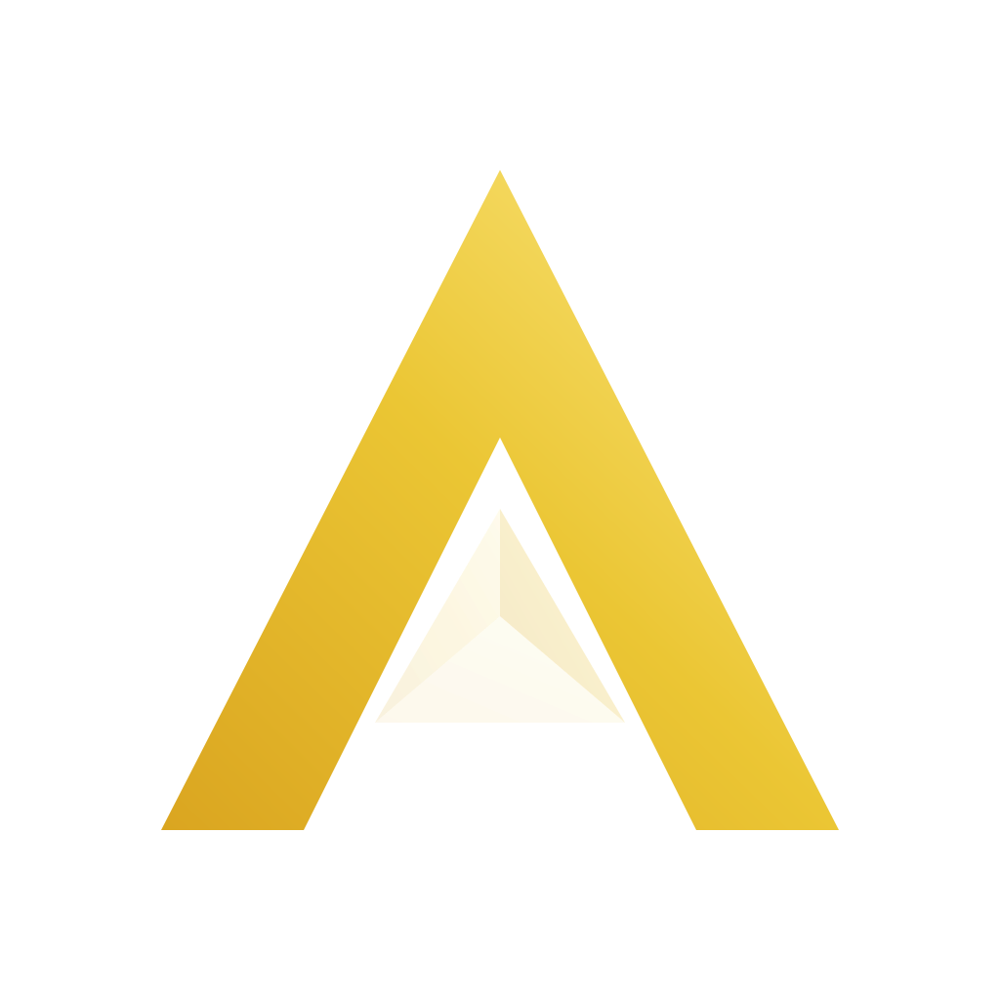

  <!-- 🌗 自适应深/浅色品牌 Logo -->
  <picture>
    <source media="(prefers-color-scheme: dark)" srcset="./assets/aurym-logo-dark.svg">
    <source media="(prefers-color-scheme: light)" srcset="./assets/aurym-logo-light.svg">
    
  </picture>

  <h1 style="font-family: 'Optima', 'Palatino Sans', sans-serif; font-weight: 300; letter-spacing: 0.25em; margin-top: 0px; color: #EBC634;">
    Aurym
  </h1>

  

    

  <!-- 🧬 产品矩阵 - 实时数据卡片 -->
  <table align="center">
    <tr>
      <td align="center">
        
         
        <strong>🎵 Aurym Music</strong>
         
        BiliBili收藏夹 · 鸿蒙音乐播放器
      </td>
      <td align="center">
        
         
        <strong>🛠️ Aurym Tools</strong>
         
        开源跨平台 · 开发者工具箱
      </td>
      <td align="center">
        
         
        <strong>📄 Aurym Docs</strong>
         
        本地优先 · Markdown 笔记
      </td>
    </tr>
  </table>
   

---

### 🌟 品牌内核：代码之诗

**Aurym** 是一首用科技谱写的诗。  
名字拆解自东方哲学中的双重太阳意象：

- **昀 (Yún)** — **日光**，温暖而包容，铺展万物的力量，正如黄金般恒久的品质 (`au` = Aurum)。
- **昕 (Xīn)** — **黎明**，破晓时分的生命力与无限可能，象征软件新生的希望。
- **rym** — **韵律** (Rhyme)，为冰冷的二进制代码注入诗歌般优雅、文艺的呼吸感。

### 🔮 设计哲学：曙光棱镜 (The Dawn Prism)

我们的品牌标识被称为 **曙光棱镜**。  
它刻画了一束黎明的曙光穿过棱镜，被优雅地**色散为有序的多维光谱**。  
这正是 Aurym 所有产品的终极使命：**将复杂、混沌的底层技术，转化为直观、优雅、富有温度的用户体验**。

---

### 🧩 统一的产品矩阵

所有 Aurym 产品共享统一的 **A 字棱镜** 图形符号，仅通过专属背景色区分，如同 Adobe Creative Cloud 一般，一眼可辨的家族感。

| 产品 | 背景色 | 定位 |
| :--- | :--- | :--- |
| **Aurym Core** | `#1C1C1C` 玛瑙深灰 | 品牌门户 · 账户中心 |
| **Aurym Music** | `#1A1028` 深邃靛蓝紫 | 沉浸式音乐播放器 |
| **Aurym Tools** | `#0A1E3D` 深海蓝 | 开源开发者工具箱 |
| **Aurym Docs** | `#0A2E1A` 深翡翠绿 | 本地优先 Markdown 笔记 |

---

 

  Made with ☀️ by the Aurym community.
   
  © 2026 Aurym. All rights reserved.

